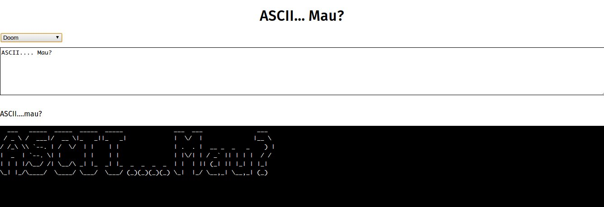

# ASCII... MAU?

Project ini dibangun dengan mengaca pada library [asciimo](https://github.com/Marak/asciimo).

Library **asciimau** memungkinkan Anda untuk mengubah sebuah tulisan menjadi karya seni dalam bentuk tulisan ASCII.

## DEMO

Anda dapat melihat contoh bagaimana **asciimau** dapat digunakan dengan melihat isi dari direktori `demo`.

## CARA PENGUNAAN

**Memanggil font yang hendak dipakai**

Sebelum mengubah tulisan ke dalam bentuk ASCII, kita perlu terlebih dahulu memanggil font yang akan digunakan untuk mengubah tulisan tersebut:

`loadFont(name, callback)`

`name` yang diberikan kepada metode `loadFont` haruslah sama dengan nama font (tanpa ekstensi). Misal: `Doh`, bukan `doh.flf`.

`callback` adalah fungsi yang akan dijalankan ketika font sudah berhasil di panggil. `callback` menerima satu parameter, yaitu object font yang telah dipanggil dan dikenali oleh `AsciiMau`.

**Mengubah tulisan menjadi ASCII**

Untuk mengubah tulisan menjadi bentuk **ascii**, kita membutuhkan teks yang hendak diubah (`writtenText`), objek font (`font`) dan fungsi yang akan dijalankan ketika proses pengubahan telah selesai (`callback`):

`write(writtenText, font, callback)`.

Fungsi `callback` akan menerima dua parameter: `result` yaitu hasil konversi dalam bentuk `String`. Kedua, objeck font yang digunakan untuk melakukan proses konversi, `font`.

## TODO

+ Penanganan Kesalahan
+ Pengujian Otomatis
+ Percantik tampilan

## SAPA-MENYAPA

Terimakasih kepada pengembang **asciimo**. Tanpa mereka, saya bakal pusing 3/4 mati dalam menggarap pustaka ini.

## LICENSE

MIT